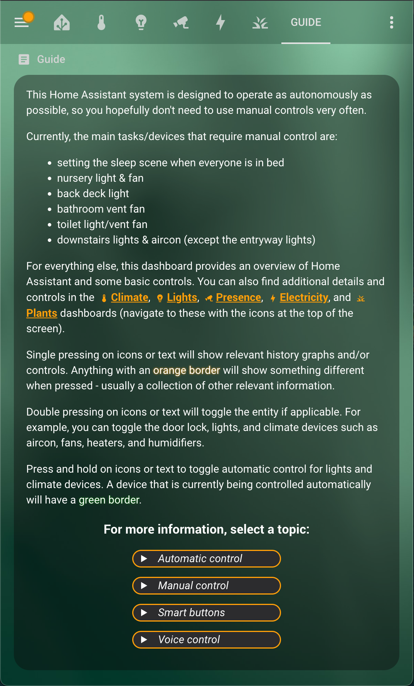
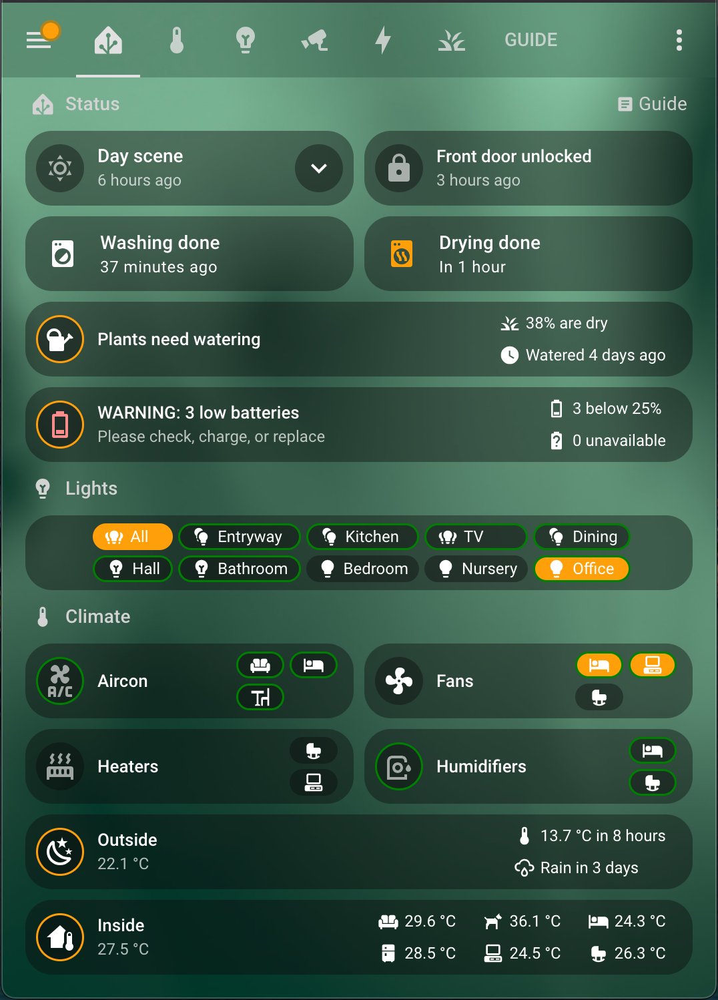

# Home Assistant

This home automation setup is based on [Home Assistant](https://www.home-assistant.io), with almost all logic implemented in Python through the [AppDaemon add-on](https://github.com/hassio-addons/addon-appdaemon).

The goal of this setup is to require as little input from users as possible - instead reacting to presence, time, climate and more.

## Usage Instructions & User Interface

Usage instructions are provided in a dedicated dashboard, as shown below:

The main dashboard shows an overview of the entire system with integrated controls and conditional warnings (e.g. dog water bowl empty or plants need watering). This is done succinctly so as to fit on a single phone screen view without scrolling.

The remaining dashboards include detailed settings, controls, and sensors for lighting, climate control, presence monitoring, electicity usage, and plant watering.

## Devices

This home automation system is comprised of the following devices:

- [Raspberry Pi 5](https://www.raspberrypi.com/products/raspberry-pi-5) with NVME running Home Assistant
- [Eero 7 Mesh WiFi System](https://www.amazon.com.au/dp/B0DB6GQFRV)
- [Zooz USB Z-Wave controller](https://www.getzooz.com/zooz-zst10-s2-stick)
- [ZigBee hub](https://www.aliexpress.com/item/1005006592375647.html)
- [Hank Z-Wave One buttons](https://www.simplysmart123.com/buttons/hank-z-wave-plus-one-button-scene-controller)
- [Ewelink smart button](https://www.aliexpress.com/item/1005006766811512.html)
- [Screek F2 mmWave presence sensors](https://docs.screek.io/f2)
- [Screek L13 mmWave presence sensors](https://docs.screek.io/l13)
- [Zooz 4-in-1 sensors](https://www.getzooz.com/zooz-zse40-4-in-1-sensor)
- [Tuya temperature and humidity sensors](https://www.aliexpress.com/item/1005006534648116.html)
- [Tuya door/window sensors](https://www.aliexpress.com/item/1005006128680908.html)
- [WiZ G95 filament bulbs](https://www.wizconnected.com/en-au/p/filament-bulb-filament-globe-amber-50w-g95-e27/8718699786793)
- [WiZ C35 filament bulb](https://www.wizconnected.com/en-au/p/filament-bulb-filament-candle-amber-25w-c35-e14/8718699787257)
- [Kogan SmarterHome RGB + cool & warm white LED strip](https://www.kogan.com/au/buy/kogan-smarterhometm-ip68-colour-whites-smart-led-light-strip-5m-kogan)
- [Hunter Pacific Evolve ceiling fans](https://www.hunterpacificinternational.com/smart-wifi-module)
- [Sensibo Sky aircon controllers](https://sensibo.com/products/sensibo-sky)
- [Mill smart panel heater](https://millnorway.com/product/mill-invisible-panel-heater-600-watt)
- [Xiaomi humidifiers](https://www.mi.com/global/product/xiaomi-smart-humidifier-2)
- [Arlec smart plugs](https://www.bunnings.com.au/arlec-grid-connect-smart-plug-in-socket-with-energy-meter-4-pack_p0273368)
- [LG C1 TV](https://www.lg.com/au/tvs/lg-oled65c1ptb) with a custom [app launcher and media state reporter](https://github.com/danVnest/LGTV-app-launcher-and-state-reporter)
- [Eufy doorbell](https://myeufy.com.au/eufy-video-doorbell-battery-powered.html)
- [Eufy security cameras](https://myeufy.com.au/eufy-cam-2c-pro-2k-2-camera-set.html)
- [Eufy indoor cameras](https://myeufy.com.au/indoor-cam-2k.html)
- [Nest Protect fire alarms](https://store.google.com/au/product/nest_protect_2nd_gen)
- [Samsung Smart Washer](https://www.samsung.com/au/washers-and-dryers/washing-machines/8kg-smart-ai-front-load-washer-ww85t554daw-ww85t554daw-sa)
- [Samsung Smart Dryer](https://www.samsung.com/au/washers-and-dryers/dryers/8kg-smart-ai-heat-pump-dryer-dv80t5420aw-dv80t5420aw-sa)
- [Fronius solar system](https://www.fronius.com/en-au/australia/solar-energy/installers-partners/technical-data/all-products/inverters/fronius-primo-gen24/fronius-primo-gen24-6-0)
- [Android](https://play.google.com/store/apps/details?id=io.homeassistant.companion.android), [iPhone and MacBook apps](https://apps.apple.com/us/app/home-assistant/id1099568401) on corresponding devices

## Notes

The following are elements of this repository which are included for reference:

- Various entities, integrations, and core configurations are now implemented through the Home Assistant UI, so some elements of [.storage](.storage) have been included. In particular, [dashboard](.storage/lovelace) config is available in JSON format. To add to your own dashboard it's easiest to copy the relevant code to your own .storage/lovelace file and restart Home Assistant.
- Manifest files from [custom components](custom_components), as managed by [HACS](https://hacs.xyz).
- [.gitignore](.gitignore) details what Home Assistant files aren't included in this repository.
