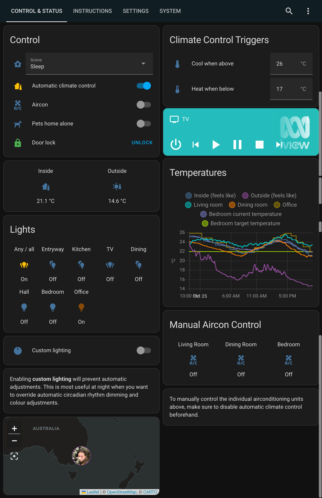

# Home Assistant

This home automation setup is based on [Home Assistant](https://www.home-assistant.io), with almost all logic implemented in Python through the [AppDaemon add-on](https://github.com/hassio-addons/addon-appdaemon).

The goal of this setup is to require as little input from users as possible - instead reacting to presence, time, climate and more.

### Usage Instructions & User Interface
The user interface primarily features configuration parameters, but does also provide manual controls and some status indicators. Usage instructions are embedded, as shown below:

#### Devices
This home automation system is comprised of the following devices:
- [Raspberry Pi 4 Model B](https://www.raspberrypi.org/products/raspberry-pi-4-model-b/) running Home Assistant
- [Orbi Router](https://www.netgear.com/orbi/)
- [Zooz USB Z-Wave controller](https://www.getzooz.com/zooz-zst10-s2-stick.html)
- [Hank Z-Wave One buttons](https://www.simplysmart123.com/buttons/hank-z-wave-plus-one-button-scene-controller/)
- [Zooz 4-in-1 sensors](https://www.getzooz.com/zooz-zse40-4-in-1-sensor.html)
- [WiZ G95 filament bulbs](https://www.wizconnected.com/en-AU/consumer/products/g95-filament-whites/)
- [Kogan SmarterHome RGB + cool & warm white LED strip](https://www.kogan.com/au/buy/kogan-smarterhome-rgb-cool-warm-white-smart-led-light-strip-5m/)
- [Sensibo aircon controllers](https://www.sensibo.com)
- [Apple TV 4K](https://www.apple.com/apple-tv-4k/)
- [Eufy battery doorbell](https://myeufy.com.au/eufy-security-video-doorbell/)
- [Nest Protect smoke alarms](https://store.google.com/au/product/nest_protect_2nd_gen)
- [Vava security cameras](https://www.vava.com/products/vava-home-camera)
- [Apple app](https://apps.apple.com/us/app/home-assistant/id1099568401?ls=1) and [Android app](https://play.google.com/store/apps/details?id=io.homeassistant.companion.android) on corresponding devices

#### Notes

The following are elements of this repository which are included for reference:
- Lovelace is configured from the UI, but [ui-lovelace.yaml](ui/ui-lovelace.yaml) contains a copy of the code from the raw configuration editor.
- Manifest files from custom components, as managed by [HACS](https://hacs.xyz).
- [.gitignore](.gitignore) details what Home Assistant files aren't included in the repository.
