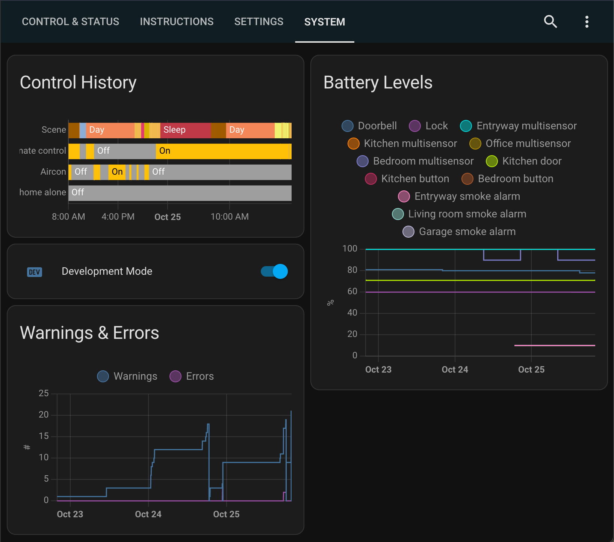

# Home Assistant

This home automation setup is based on [Home Assistant](https://www.home-assistant.io), with almost all logic implemented in Python through the [AppDaemon add-on](https://github.com/hassio-addons/addon-appdaemon).

The goal of this setup is to require as little input from users as possible - instead reacting to presence, time, climate and more.

### Usage Instructions & User Interface
The user interface primarily features configuration parameters, but does also provide manual controls and some status indicators. Usage instructions are embedded, as shown below:

#### Devices
This home automation system is comprised of the following devices:
- [Raspberry Pi 4 Model B](https://www.raspberrypi.org/products/raspberry-pi-4-model-b) running Home Assistant
- [Orbi AC3000 Mesh WiFi System](https://www.netgear.com/home/wifi/mesh/rbk50)
- [Zooz USB Z-Wave controller](https://www.getzooz.com/zooz-zst10-s2-stick)
- [Hank Z-Wave One buttons](https://www.simplysmart123.com/buttons/hank-z-wave-plus-one-button-scene-controller)
- [Zooz 4-in-1 sensors](https://www.getzooz.com/zooz-zse40-4-in-1-sensor)
- [Dome Z-Wave Plus Door/Window Sensor](https://smarthomedirect.com.au/product/dome-z-wave-pro-door-window-sensor)
- [WiZ G95 filament bulbs](https://www.wizconnected.com/en-au/p/filament-bulb-filament-globe-amber-50w-g95-e27/8718699786793)
- [WiZ C35 filament bulb](https://www.wizconnected.com/en-au/p/filament-bulb-filament-candle-amber-25w-c35-e14/8718699787257)
- [Kogan SmarterHome RGB + cool & warm white LED strip](https://www.kogan.com/au/buy/kogan-smarterhometm-ip68-colour-whites-smart-led-light-strip-5m-kogan)
- [Sensibo Sky aircon controllers](https://sensibo.com/products/sensibo-sky)
- [LG C1 TV](https://www.lg.com/au/tvs/lg-oled65c1ptb)
- [Eufy battery doorbell](https://myeufy.com.au/eufy-video-doorbell-battery-powered.html)
- [Nest Protect smoke alarms](https://store.google.com/au/product/nest_protect_2nd_gen)
- [Vava security cameras](https://www.kickstarter.com/projects/2130897358/vava-home-cam-wire-free-security-with-a-one-year-b)
- [Samsung Smart Washer](https://www.samsung.com/au/washers-and-dryers/washing-machines/8kg-smart-ai-front-load-washer-ww85t554daw-ww85t554daw-sa)
- [Samsung Smart Dryer](https://www.samsung.com/au/washers-and-dryers/dryers/8kg-smart-ai-heat-pump-dryer-dv80t5420aw-dv80t5420aw-sa)
- [Android](https://play.google.com/store/apps/details?id=io.homeassistant.companion.android), [iPhone and MacBook apps](https://apps.apple.com/us/app/home-assistant/id1099568401) on corresponding devices

#### Notes
The following are elements of this repository which are included for reference:
- The Home Assistant dashboard is configured from the UI, but [ui-lovelace.yaml](ui/ui-lovelace.yaml) contains a copy of the code from the raw configuration editor.
- Manifest files from custom components, as managed by [HACS](https://hacs.xyz).
- [.gitignore](.gitignore) details what Home Assistant files aren't included in the repository.